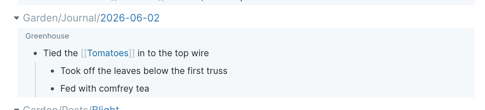
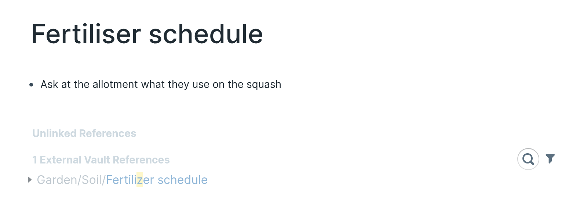
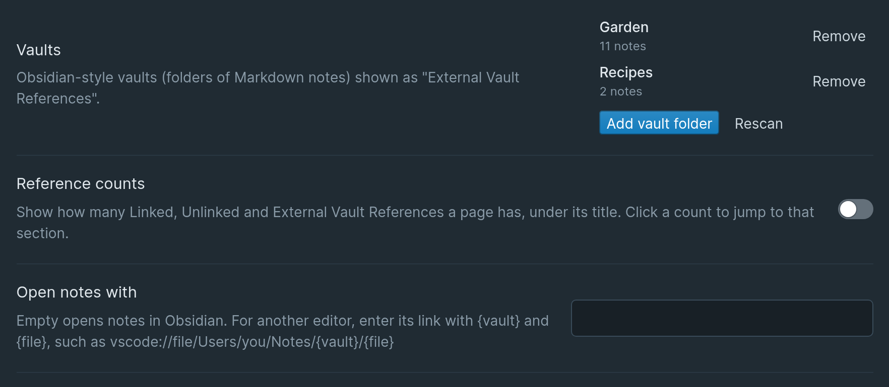
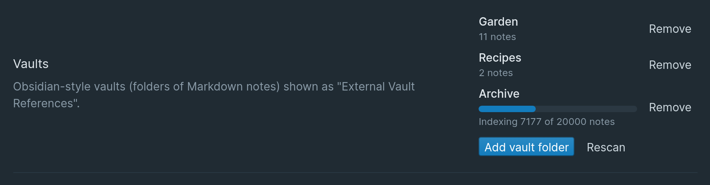
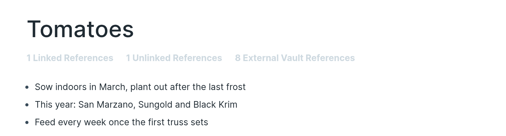

# Vaults

See notes from your Obsidian-style vaults in your Roam graph.

Vaults adds an **External Vault References** section to every Roam page. It sits below Linked and
Unlinked References and looks like them. It lists the notes in your Obsidian-style vaults, meaning local
folders of Markdown notes, that are about the page you're on or link to it.

It only reads your vault. Nothing from the vault is written to your Roam graph, and nothing is sent over the
network.

<b>What's an Obsidian-style vault?</b>

A vault is just a folder of Markdown (`.md`) files on your computer, with subfolders, that link to each
other. [Obsidian](https://obsidian.md) made the idea popular. See
[How Obsidian stores data](https://help.obsidian.md/data-storage) for what a vault is, and
[Internal links](https://help.obsidian.md/links) and
[Obsidian Flavored Markdown](https://help.obsidian.md/obsidian-flavored-markdown) for the link and tag
syntax Vaults understands. You don't need Obsidian installed: any folder of Markdown notes works.

That includes **Open Knowledge Format (OKF)** bundles. [OKF](https://github.com/open-knowledge-format/open-knowledge-format)
is an open format for knowledge kept as plain Markdown files with YAML frontmatter
([spec](https://github.com/open-knowledge-format/open-knowledge-format/blob/main/SPEC.md)). Vaults reads a
bundle the way OKF means it. A folder is a bundle when its `index.md` has `okf_version` in its
frontmatter, as the spec asks bundles to have:

- A note is found by its `title` as well as its file name, so the page **Country Sourdough Loaf** shows
  `products/country-sourdough.md`. In a bundle the title is also the note's name, wherever the note is shown.
- `type` and `status` are page references, so the page **Metric** lists every note with `type: Metric`.
- A folder's `index.md` is the note for the page named like the folder: **Products** shows
  `products/index.md`.
- Each day of a `log.md` (`## 2026-11-21`) is a reference on that day's daily page, with the day's entries
  under it.
- Standard Markdown links are followed, including bundle-absolute ones like
  `[Customers](/tables/customers.md)`, as well as `[[wikilinks]]`. In a bundle a link is read from the
  note's own folder first, and one that starts with `/` from the bundle's folder.

## What it shows

One section covers every vault you add, and its count is the total across vaults. Notes are titled by
their path in the vault, such as `Projects/Kernel meeting protocol`. With more than one vault, the vault
name comes first in grey, such as `work-vault/Projects/Kernel meeting protocol`. The section lists four
kinds of notes, in this order:

- **The note that is this page**, listed first and folded. A note matches when it has the same name (in any
  letter case), lists the page title as an alias, sits at the same folder path (Roam `A/B` and `A/B.md`), or
  is the daily note for the same date. If several notes match, they're all shown. Click the caret to unfold
  the note and read it in place.
- **Notes that link here.** These are notes that link to the matching note, or contain `[[This Page]]` even
  when no such note exists. Links in frontmatter count too. Each linking line is shown as Roam shows a
  reference: the block, with the headings and list items it sits under as a path above it.
- **Notes tagged here.** These are notes tagged `#this-page`, shown with the tag. A Roam namespace `a/b`
  matches the nested tag `#a/b`.
- **Notes with a similar name**, only when no note is this page. These are notes whose name or alias is
  close to the page title: a typo or two swapped letters (`Recieve Window` for **Receive Window**), a plural,
  or the same words in another order (`Ridley Scott` for **Scott, Ridley**). They come last, faded and
  folded, with the letters that differ highlighted. Every word must start with the same letter and keep its
  numbers, so `Q3 Plan` never matches `Q4 Plan`, and titles under five letters don't get them.

### Notes look like Roam blocks

A note is drawn as the outline Roam would make of it. Headings, list items and paragraphs are blocks, a
nested list is nested blocks, and frontmatter properties are attributes. A line that links to the page
is drawn as in Linked References, and works the same way:

- The path above a line names the headings and list items it sits under. Click a part of the path to open it
  in place.
- A line with items nested under it has a caret. Click it to show them.
- Links, tags, bold, highlights and to-do boxes are drawn as Roam draws them. Whether `[[` `]]` show follows
  your own Roam setting.
- Click a link to open that page in Roam, or shift-click to open it in the sidebar. A link to a note that
  has no page opens the note.
- A link to a block of a note (`[[Note#^id]]`) shows that block's text, as a block reference does in Roam.
  A link to a heading reads "Note > Heading". A click on either opens the note at that place.
- An embedded block or heading (`![[Note#^id]]`, `![[Note#Heading]]`) is drawn in place, as an embed is in
  Roam. An embedded note (`![[Note]]`) shows its title; click the bar at its left to open it there.
- Pictures kept in the vault (`![[photo.png]]`, ``) show inline. They are read from
  the folder on your device.
- Tables are drawn as Roam's tables, and numbered lists keep their numbers.
- Properties read as Roam attributes. A date in a property (`created: 2026-11-09`) links to that day, so
  the day's page in Roam lists the note. A link or a path to a note in a property counts as a link too. A
  property's name is a page too, as an attribute's is in Roam: the page **author** lists the notes with an
  `author` property.

Notes exported from Roam as Markdown come out with the same blocks, paths and links they had in Roam.

Click a note title or a line's bullet to open the whole note in Roam's main window, as a page opens. Back
returns to where you were, and links between notes work inside it. Shift-click opens the note over the page
instead. If you use Obsidian, click **Open in Obsidian** beside the note's title to jump to the note there. To use another
editor, see [Opening notes in another editor](#opening-notes-in-another-editor).

The section's header has the same search box and filter as Linked References. Search narrows the lines to
those with the words you type. The filter lists the pages the lines link to: click one to keep only the
lines that link to it, shift-click to hide them. The filter stays with the page while Roam is open.

### Notes with a similar name

When no note is named after the page, the section suggests notes whose name is close to it, so a typo or
another spelling doesn't hide a note. Here the page is **Fertiliser schedule** and the note is
`Soil/Fertilizer schedule`:

The section updates by itself. When you edit a note in Obsidian or any other editor, the change shows up in Roam within about a
second.

## Requirements

- **Roam desktop app** (tested on macOS and Linux). Roam in Chrome or Edge should also work, but the browser asks you to
  allow folder access again on each visit unless you choose "Allow on every visit". Other browsers and
  Roam's mobile apps can't read local folders (see [Mobile](#mobile)).
- A folder of Markdown (`.md`) files, such as an Obsidian vault or an OKF bundle. Obsidian vaults work
  best: daily-note formats, aliases and tags are read the way Obsidian reads them.

## Getting started

1. Install **Vaults** from Roam Depot.
2. Open **Settings → Roam Depot → Vaults**.
3. Click **Add vault folder**, choose your vault folder, and allow access when asked.

Matching notes then show up below Linked References, as **"External Vault References"**. The
section appears only on pages that have matching vault notes. Other pages look exactly as before. The first
scan reads every note. After that, only changed files are read again.

Choose the vault folder itself, such as `Documents/My Vault`, not a folder above it like `Documents` or
your home folder. You can't type a folder path: Roam can only read a folder you pick in the system's
folder dialog.

### Managing vaults

Everything is in **Settings → Roam Depot → Vaults**:

- **Add vault folder** adds another vault. Notes from all your vaults appear in the same section on each
  page, each title starting with its vault's name.
- Each vault shows its status here, such as its note count, "Indexing" or "Needs permission again".
  The page itself never shows indexing or permission notices.
- While a vault is scanned, its row shows a progress bar. Pages keep showing the vault's notes meanwhile.
- **Remove** forgets that vault on this computer and deletes its index. Your files aren't touched.
- **Reconnect** appears when Roam needs your permission again to read a vault.
- **"Last scan didn't finish"** means Roam crashed while reading that vault. It isn't read again until
  you click **Rescan** in its row (see [Troubleshooting](#troubleshooting)).
- **Rescan** reads every vault again, except one whose last scan didn't finish. Only changed files are parsed.
- **Reference counts** turns on the line of counts under each page title (see below). It's off until you turn it on.

Vaults adds no commands to the command palette.

### Reference counts

On a page with a lot of references, the vault notes are far down. Turn on **Reference counts** in
**Settings → Roam Depot → Vaults** to see, under each page title, how many Linked, Unlinked and External Vault
References the page has. Click a count to jump to that section.

A count of zero is left out. Unlinked references are counted the way Roam counts them when you open that
section: blocks that mention the page's title without linking to it.

### Large vaults

Vaults keeps its index of your notes in a database on this computer instead of in memory, so a large vault
costs little while Roam is open. Measured in Roam's desktop app with a vault of 100,000 notes:

| | |
| --- | --- |
| First scan | about 20 seconds |
| Memory the vault takes once scanned | about 35 MB |
| A page shows its vault notes after Roam starts | about 2 seconds |

After a start, pages show vault notes from the saved index straight away, and the files are checked for
changes in the background. If you open the graph in a second Roam window or tab, it uses the first
window's index instead of reading the vault again.

## Troubleshooting

<b>Roam can't open the folder I picked</b>

macOS protects `Documents`, `Desktop`, `Downloads` and your home folder, and Roam can't open them
directly. Choose the vault folder inside them instead, such as `Documents/My Vault`. If Roam already
refused a folder, quit and reopen Roam before you try again.

<b>A vault says "Needs permission again"</b>

Roam needs you to allow access to that folder again. Click **Reconnect** in its row and allow access. In Chrome or Edge, choose "Allow on every
visit" so the browser doesn't ask each time.

<b>A vault says "Last scan didn't finish"</b>

Roam crashed while reading that vault, for example because it ran out of memory on a very large folder.
So that Roam stays usable, the vault isn't read again on start until you click the **Rescan** in its
row. If it keeps happening, remove the vault or choose a smaller folder.

<b>A note I expect isn't listed</b>

Check that it matches one of the rules in [What it shows](#what-it-shows): same name, an alias, the
same folder path, the same daily-note date, a `[[link]]` or a `#tag`. A note with a similar name is only
suggested on a page that no note is named after. Only `.md` files are read. If you just changed the note and it doesn't show yet, click **Rescan**.

### Opening notes in another editor

The button beside a note's title opens notes in Obsidian. To open them in another editor instead, fill in **Open notes
with** in **Settings → Roam Depot → Vaults** with the link your editor uses to open a file. Put `{vault}`
where the vault folder's name goes and `{file}` where the note's path inside the vault goes. The button then
reads **Open in editor**. Leave the field empty to go back to Obsidian.

Roam can't tell the extension where your vault folder is on disk, so type the folder that holds your vaults
yourself. For vaults in `/Users/you/Notes`:

| Editor | Open notes with |
| --- | --- |
| VS Code | `vscode://file/Users/you/Notes/{vault}/{file}` |
| Cursor | `cursor://file/Users/you/Notes/{vault}/{file}` |
| Zed | `zed://file/Users/you/Notes/{vault}/{file}` |
| BBEdit | `x-bbedit://open?url=file:///Users/you/Notes/{vault}/{file}` |

The setting applies to every vault, so this works when your vaults sit in the same folder.

## Privacy

- **Read-only.** The extension reads your vault folder and never changes it. It never writes vault content
  into your Roam graph.
- **Stays on this computer.** The extension makes no network requests. Which folders your vaults are, and
  the index of their notes that makes later starts fast, are kept in the Roam app's storage on this computer.
  They aren't stored in your graph and don't sync to your other devices or to other people in a shared graph.
  They stay there when the extension is turned off or removed from Roam Depot. To delete them, remove each
  vault in the settings first.
- **Folder access you control.** The extension can only read folders you choose. Removing a vault deletes
  its saved folder access and its index.
- **Who sees the section.** The section is drawn on your screen only. Collaborators on a shared graph don't
  see your vault unless they install the extension and add a vault themselves.

## Mobile

Roam's mobile apps can't read folders on your phone, so External Vault References doesn't show on mobile in
this version.

<b>A possible mobile snapshot, and its privacy tradeoff</b>

A later version may add an opt-in **mobile snapshot**. Your desktop would upload a copy of the vault index
into your graph's file storage, and your phone would read that copy. It will be off unless you turn it on.
Before you turn it on, know this: Roam's file links aren't private. **Anyone who has the snapshot's link can
download it without signing in to Roam.** The link is hard to guess, but it's stored in your graph, so anyone
who can read your graph can find it, and you can't revoke a copy someone has already downloaded. Don't use the
snapshot for a vault you wouldn't want shared that way.

## Limits in this version

- Notes are shown as read-only previews. Edit them in Obsidian or your usual editor.
- Only `.md` files are read. Canvas files, PDFs and attachments are skipped.
- Files and folders your vault's `.gitignore` files ignore, or that Obsidian's **Excluded files** setting
  lists, are skipped. So are folders whose name starts with a dot, such as `.obsidian` and `.trash`.

## Feedback and source

Report problems or ideas at [github.com/sweenzor/roam-vaults/issues](https://github.com/sweenzor/roam-vaults/issues).
The source code, design notes and changelog are at
[github.com/sweenzor/roam-vaults](https://github.com/sweenzor/roam-vaults).
